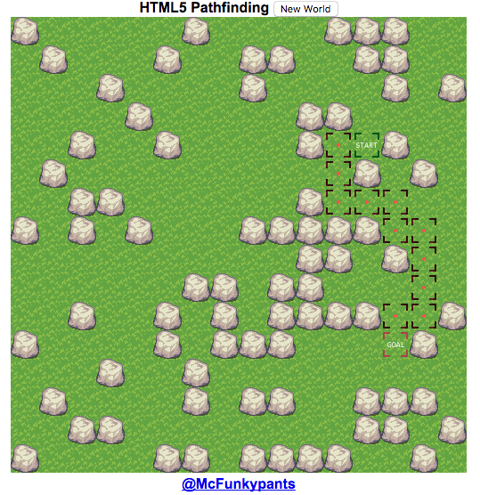

# A-Star Pathfinding for Game AI

**HTML5 Shortest Path**

A* Pathfinding algorithm exploration using HTML5 Canvas. Investigation follows lesson from BNG. Function traverses a graph that is a map of game world. Adds up cost of each path from A to B, then decides.

Basic random world is generated using HTML5 canvas element. World is rendered using a spritesheet and canvas drawImage(). Sprite sheet contains grass, boulders, start, end, and path tiles. World is a two-dimensional array holding index of spritesheet.


```
http://buildnewgames.com/astar/

// A* Pathfinding for HTML5 Canvas Tutorial
// by Christer (McFunkypants) Kaitila
// http://www.mcfunkypants.com
// http://twitter.com/McFunkypants

// Based on Edsger Dijkstra's 1959 algorithm and work by:
// Andrea Giammarchi, Alessandro Crugnola, Jeroen Beckers,
// Peter Hart, Nils Nilsson, Bertram Raphael
```

**Project Uses:**
* World Generation
* World Rendering
* User Interactivity
* A* Pathfinding
* Manhattan distance Heuristic
* Path Cost Processing



**Alternate Distance Finding**

```
	function DiagonalDistance(Point, Goal)
	{	// diagonal movement - assumes diag dist is 1, same as cardinals
		return max(abs(Point.x - Goal.x), abs(Point.y - Goal.y));
	}

	function EuclideanDistance(Point, Goal)
	{	// diagonals are considered a little farther than cardinal directions
		// diagonal movement using Euclide (AC = sqrt(AB^2 + BC^2))
		// where AB = x2 - x1 and BC = y2 - y1 and AC will be [x3, y3]
		return sqrt(pow(Point.x - Goal.x, 2) + pow(Point.y - Goal.y, 2));
	}

	// returns every available North East, South East,
	// South West or North West cell - no squeezing through
	// "cracks" between two diagonals
	function DiagonalNeighbours(myN, myS, myE, myW, N, S, E, W, result)
	{
		if(myN)
		{
			if(myE && canWalkHere(E, N))
			result.push({x:E, y:N});
			if(myW && canWalkHere(W, N))
			result.push({x:W, y:N});
		}
		if(myS)
		{
			if(myE && canWalkHere(E, S))
			result.push({x:E, y:S});
			if(myW && canWalkHere(W, S))
			result.push({x:W, y:S});
		}
	}
	
	// returns every available North East, South East,
	// South West or North West cell including the times that
	// you would be squeezing through a "crack"
	function DiagonalNeighboursFree(myN, myS, myE, myW, N, S, E, W, result)
	{
		myN = N > -1;
		myS = S < worldHeight;
		myE = E < worldWidth;
		myW = W > -1;
		if(myE)
		{
			if(myN && canWalkHere(E, N))
			result.push({x:E, y:N});
			if(myS && canWalkHere(E, S))
			result.push({x:E, y:S});
		}
		if(myW)
		{
			if(myN && canWalkHere(W, N))
			result.push({x:W, y:N});
			if(myS && canWalkHere(W, S))
			result.push({x:W, y:S});
		}
	}
```
